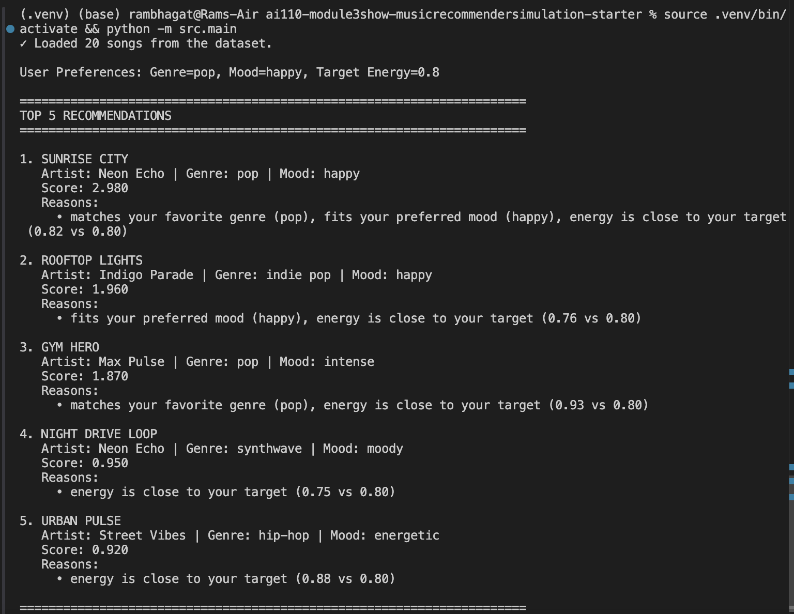
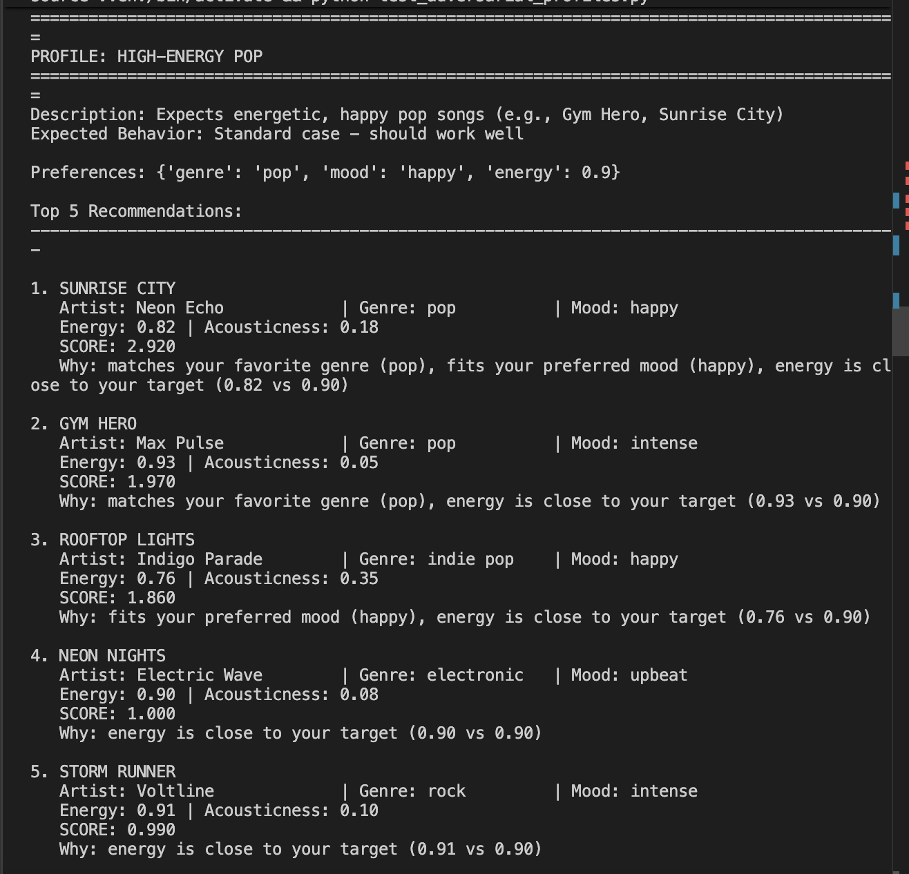
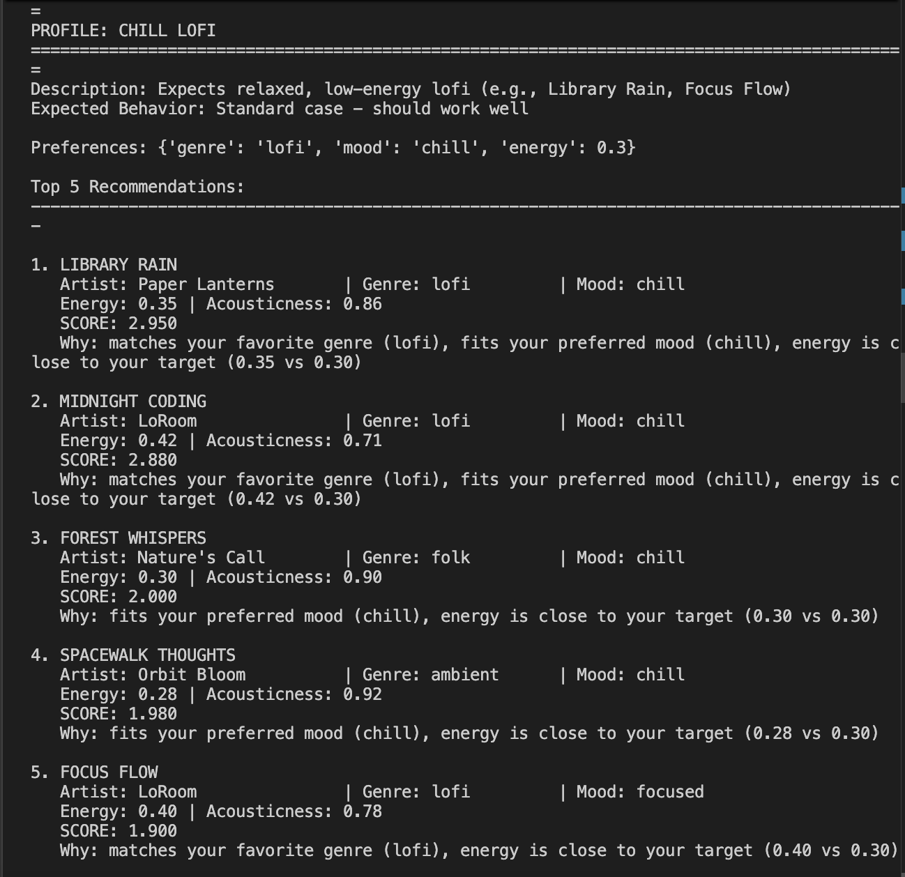
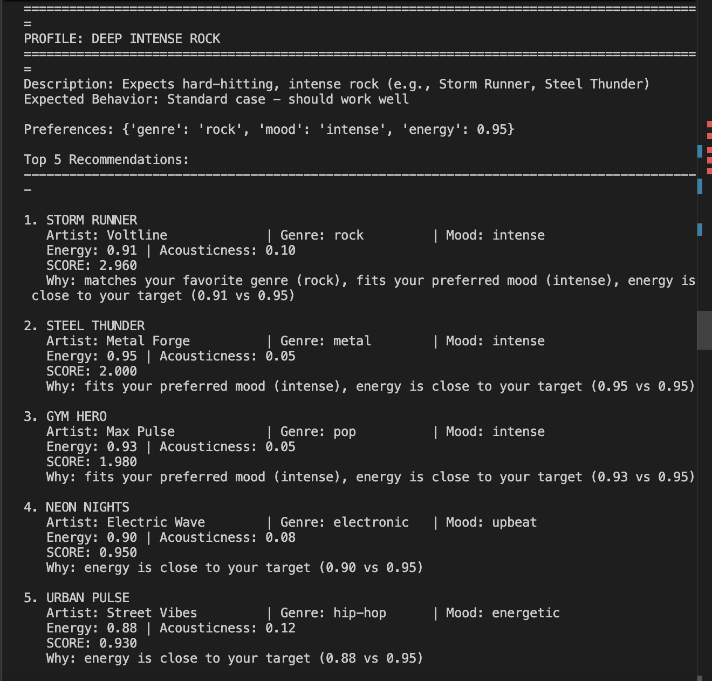
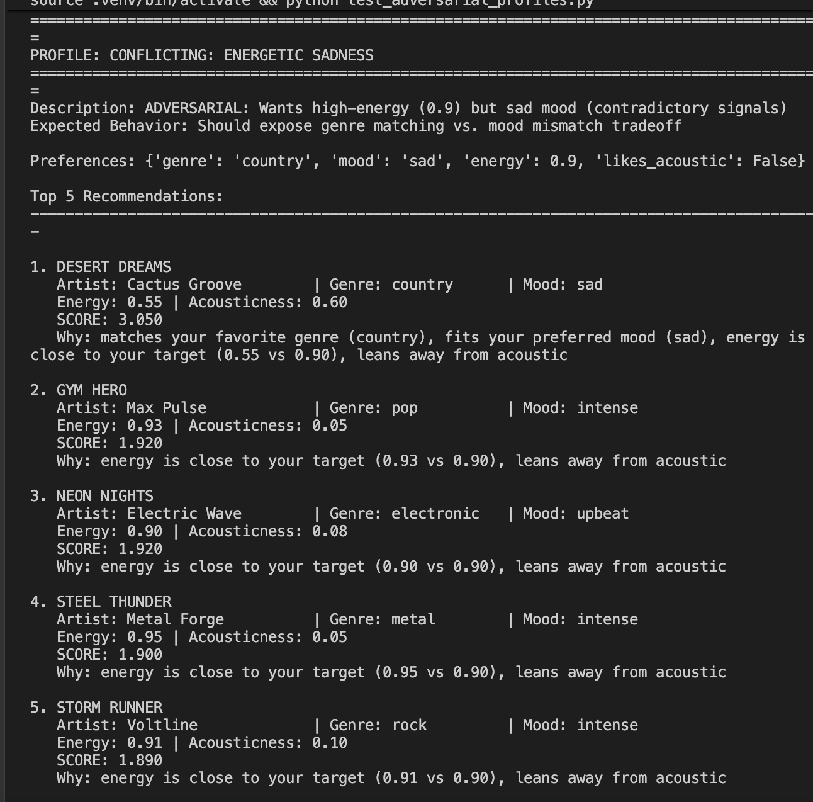
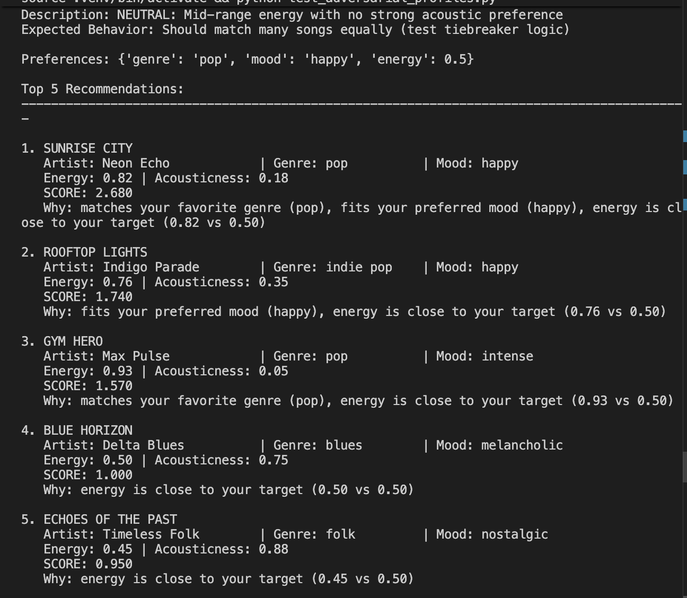

# 🎵 Music Recommender Simulation

## Project Summary

**VibeScorer 1.0** is a lightweight music recommender that matches songs to user taste profiles using a weighted scoring system. Given a user's preferences (genre, mood, energy level, acoustic preference), the system scores each song in a 20-song catalog based on categorical matches (genre, mood) and numeric similarity (energy proximity, acousticness alignment). The top 5 highest-scoring songs are returned with explanations—making the recommendation logic transparent and inspectable.

This project demonstrates how simple scoring rules can create surprisingly sophisticated recommendations, while also exposing fundamental limitations: conflicting preferences, dominant signals that suppress others, and biases baked into scoring weights. By testing the system with adversarial user profiles, I identified where the recommender excels and where it fails gracefully.

---

## How The System Works

### Song Features
Each song in the catalog is represented by:
- **Categorical:** genre, mood
- **Numeric (0–1 scale):** energy, tempo (BPM), valence, danceability, acousticness

### User Profile
Users specify:
- `genre` — their favorite music genre (e.g., "pop", "lofi")
- `mood` — preferred emotional context (e.g., "happy", "chill")
- `energy` — target energy level on a 0–1 scale (0 = ultra-calm, 1 = maximum intensity)
- `likes_acoustic` (optional) — whether they prefer acoustic or electric sounds

### Scoring Logic

For each song, the recommender computes a score combining:

1. **Genre Match:** If the song's genre exactly matches the user's favorite → **+1.0 points**
2. **Mood Match:** If the song's mood exactly matches the user's preferred mood → **+1.0 points**
3. **Energy Proximity:** How close the song's energy is to the user's target.
   - Formula: `1.0 - |song_energy - target_energy|`
   - Example: User wants 0.8 energy; a song at 0.82 scores ~0.98; a song at 0.3 scores 0.5
4. **Acousticness Alignment:**
   - If `likes_acoustic=True`: add the song's acousticness value (0–1) as a bonus
   - If `likes_acoustic=False`: add `1 - acousticness` (boost non-acoustic songs)

**Final Score = genre_match + mood_match + energy_proximity + acousticness_bonus**

### Recommendation Process
1. Score all 20 songs using the above formula
2. Sort by score (highest first)
3. Return top 5 songs with their scores and explanations

---

## Getting Started

### Setup

1. Create a virtual environment (optional but recommended):

   ```bash
   python -m venv .venv
   source .venv/bin/activate      # Mac or Linux
   .venv\Scripts\activate         # Windows

2. Install dependencies

```bash
pip install -r requirements.txt
```

3. Run the app:

```bash
python -m src.main
```

### Running Tests

Run the starter tests with:

```bash
pytest
```

You can add more tests in `tests/test_recommender.py`.

---

## Experiments You Tried

I designed and tested **11 user profiles**— (see test_adversarial_profiles.py) to evaluate how well the scoring logic handles conflicting preferences and extreme scenarios.



#### Standard Profiles

**High-Energy Pop**


**Chill Lofi**


**Deep Intense Rock**


**Energetic + Intense Sadness** (High energy 0.9 but sad mood)


**Neutral Fence-Sitter** (Mid-range energy, no strong acoustic preference)


#### Key Findings

- Genre matching heavily outweighs mood preferences (±1.0 bonus dominates)
- Acoustic preference is fragile and easily overridden by genre/energy factors
- System degrades gracefully for non-existent genres (falls back to mood/energy)
- Extreme cases (energy 0.1 or 1.0) are handled well with acoustic preference acting as a strong modifier

---

## Limitations and Risks

- **Tiny catalog:** With only 20 songs, recommendations are heavily constrained. Some genres appear only once or twice, skewing results.
- **Genre match dominates:** A single genre match worth +1.0 can overwhelm other signals. Users asking for "energetic + sad" get energetic songs regardless of mood match.
- **No contextual understanding:** The system doesn't know listening context, mood drift, or history. All recommendations are stateless.
- **Rigid categorical matching:** Genres and moods must match exactly—no fuzzy or partial credit for related categories.
- **Acousticness bias:** Acoustic preference (0–0.75 range) is weaker than genre/mood bonuses (±1.0), making it easy to override.
- **No diversity enforcement:** Top 5 recommendations might cluster around very similar songs instead of providing variety.

See [**Model Card**](model_card.md) for deeper analysis.

---

## 7. Evaluation

**Testing Approach:** I created a comprehensive test suite (`test_adversarial_profiles.py`) with 11 distinct user profiles spanning standard cases and adversarial edge cases. Each profile was run through the recommender, and I evaluated whether the top recommendation matched intuitive expectations.

**Profiles Tested:**
- **Standard cases** (3): High-Energy Pop, Chill Lofi, Deep Intense Rock
- **Adversarial cases** (8): Conflicting Sadness, Acoustic Paradox, Moody Acoustic Lover, Anti-Acoustic Rocker, Neutral Fence-Sitter, Mystery Genre (non-existent), Extreme Chill (0.1), Extreme Energy (1.0)

**What I Looked For:**
- Did the top-ranked song match the user's primary preference?
- Were conflicting signals handled gracefully or did one preference blindside others?
- Did the recommendations degrade gracefully for edge cases?
- Were scores calculated consistently?

**Key Validation Checks:**
- Spot-checked score calculations to verify genre/mood bonuses and energy proximity formulas
- Verified that non-existent genres didn't crash the system and fell back to mood/energy matching
- Confirmed that extreme energy values (0.1, 1.0) produced sensible results
- Tested all 11 profiles and verified results matched my intuitions for standard cases and exposed weaknesses for adversarial cases

**Results:** Standard profiles produced expected results; adversarial profiles revealed that genre dominance, mood insensitivity, and weak acousticness preference are the system's key limitations.

---

## 8. Future Work

**Short-term improvements:**
- **Conflict resolution:** Detect when user preferences contradict (e.g., high energy + sad mood) and either warn the user or intelligently compromise with a hybrid strategy.
- **Weighted preferences:** Allow users to specify importance weights ("energy matters 2x more than genre to me") so scoring adapts to individual priority hierarchies.
- **Diversity enforcement:** After ranking by score, re-rank to ensure top-5 span different genres/moods instead of clustering around the single best match.
- **Mood penalty system:** Penalize mood mismatches (not just fail to add bonus) to make mood-sensitive matching more precise.

**Medium-term improvements:**
- **Collaborative filtering:** Track what songs similar users liked and recommend based on user clusters ("Users like you also enjoyed...").
- **Temporal context:** Adapt recommendations based on time of day, user listening history, or seasonal patterns (morning upbeat, evening chill).
- **Expanded features:** Add instrumentation (acoustic guitar, synth, strings), lyrical themes, artist novelty/popularity, and valence (positivity) as first-class features.
- **Cold-start handling:** For new users, guide preference elicitation with a questionnaire ("Rate your acoustic preference 1-10").

**Long-term research:**
- **Serendipity vs. precision:** Balance giving users exactly what they ask for vs. surprising them with undiscovered artists/genres they'll love.
- **Fairness audits:** Measure whether the system recommends underrepresented artists/genres fairly or amplifies majority bias.
- **Interactive refinement:** Let users rate recommendations in real-time to dynamically re-rank remaining songs without retraining.

---

## 9. Personal Reflection

Building VibeScorer taught me that recommender systems are far more nuanced than I initially realized. What appears to users as a simple "ranked list of songs" hides dozens of interconnected decisions: how to weight conflicting signals, whether genre should dominate mood, how to handle edge cases gracefully, and what to do when user preferences contradict themselves. The most surprising discovery was how much the scoring *weights* matter—a small shift in how much genre matching is worth relative to energy similarity completely reshapes what gets recommended. This realization deepened my appreciation for Spotify's engineering: their recommender doesn't just serve what you explicitly asked for, but strategically balances satisfying your current taste with introducing you to artists and moods you haven't discovered yet. That balance between precision and serendipity—between "giving the user what they want" and "surprising them with something great"—is the real art of recommendation systems.